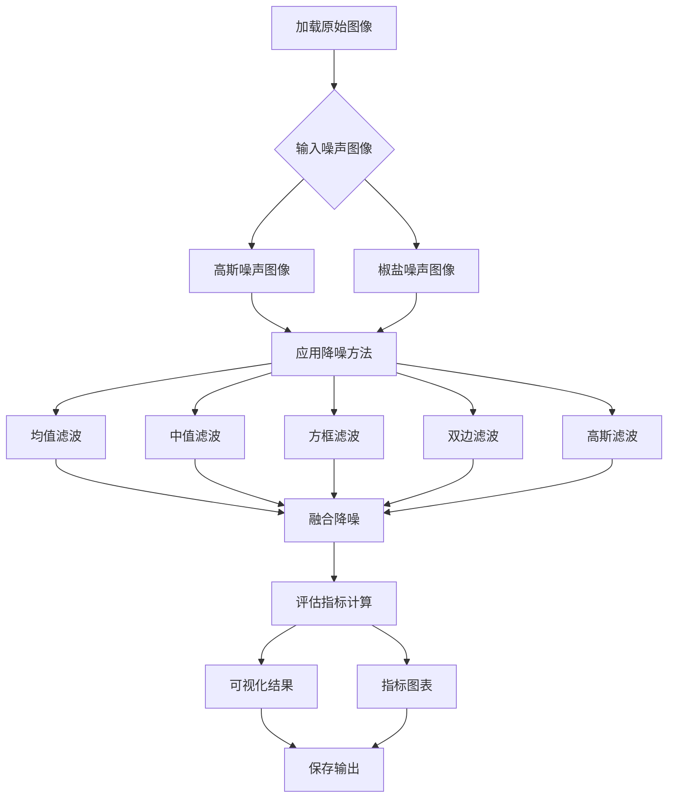

### 图像降噪算法设计文档

#### **1. 图像降噪概述**

使用 cmos sensor获取图像，光照程度和传感器问题是生成图像中大量噪声的主要因素。同时， 当信号经过ADC 时， 又会引入其他一些噪声。 这些噪声会使图像整体变得模糊， 而且丢失很多细节， 所以需要对图像进行去噪处理空间去噪。

---

#### **2. 算法选择**
传统的降噪方法有均值滤波、 高斯滤波等。

但是， 一般的高斯滤波在进行采样时主要考虑了像素间的空间距离关系， 并没有考虑像素值之间的相似程度， 因此这样得到的模糊结果通常是整张图片一团模糊。 所以， 一般采用非线性去噪算法， 例如双边滤波器， 在采样时不仅考虑像素在空间距离上的关系， 同时加入了像素间的相似程度考虑， 因而可以保持原始图像的大体分块， 进而保持边缘。

同时，考虑到单一降噪算法处理图像时处理能力有限，故而尝试融合多种降噪方式，按照一定权重进行降噪。


#### **3. 算法介绍**

(1) 中值滤波
以目标像素周围3 × 3 3\times33×3的邻域为例，就是将3 × 3 3\times33×3邻域中九个像素灰度值进行排序，将中间灰度值作为目标像素的灰度值。椒盐噪声影响的像素的灰度值通常都非常大或者非常小，因此通过排序会被消除掉。

(2) 均值滤波
同样以目标像素周围3 × 3 3\times33×3的邻域为例，就是将3 × 3 3\times33×3邻域中九个像素灰度值的平均值作为目标像素的灰度值

(3) 高斯滤波
高斯滤波就是将均值滤波中的平局值改为高斯加权平均值，邻域中年距离目标像素越远的像素灰度值权重越小，通常通过生成一个高斯模板实现

(4) 双边滤波
双边滤波是在高斯滤波的基础上在权重设计中进一步考虑了像素灰度梯度的影响，首先考虑高斯部分权重（下图中的Spatial weight）：

然后考虑像素灰度梯度部分权重（下图中的Range weight）：

其中(i,j)为模板中邻域像素坐标，(i,j)为模板中心像素坐标，f(i,j)为坐标(i,j)处的像素值，σd 和σr分别为两个权重的方差，将两部分权重相乘即获得双边滤波的权重：


#### **4. 算法流程图**


---

#### **3. 核心模块设计**

##### **3.1 降噪方法库**
| 方法        | 函数调用                     | 参数说明                          | 适用场景           |
|-------------|-----------------------------|-----------------------------------|-------------------|
| 均值滤波    | `cv2.blur()`                | 3×3核                             | 均匀噪声          |
| 中值滤波    | `cv2.medianBlur()`          | 3×3核                             | 椒盐噪声          |
| 方框滤波    | `cv2.boxFilter()`           | 3×3核+归一化                      | 均匀噪声          |
| 双边滤波    | `cv2.bilateralFilter()`     | d=15, sigmaColor=75, sigmaSpace=75 | 纹理保持          |
| 高斯滤波    | `cv2.GaussianBlur()`        | 5×5核, sigma=0                     | 高斯噪声          |

##### **3.2 融合策略**
```python
# 加权融合权重配置
weights = {
    'mean': 0.15,      # 基础降噪
    'median': 0.30,    # 强化椒盐噪声处理
    'box': 0.15,       # 基础降噪
    'bilateral': 0.25, # 保护边缘信息
    'gaussian': 0.15   # 基础降噪
}

# 双阶段融合
fused = Σ(权重 * 方法结果)                # 阶段1：加权融合
median_fused = median(mean,median,bilateral,gaussian) # 阶段2：中值融合
final = 0.7*fused + 0.3*median_fused      # 结果融合
```

##### **3.3 评估指标**
| 指标  | 函数调用                          | 计算说明                          |
|-------|----------------------------------|----------------------------------|
| PSNR  | `compare_psnr()`                 | 峰值信噪比 >30dB为优质           |
| SSIM  | `compare_ssim(multichannel=True)` | 结构相似性 越接近1越好           |
| MSE   | `compare_mse()`                  | 均方误差 越低越好                 |


---

#### **4. 使用示例(运行结果展示)**
```python
# 处理椒盐噪声图像
sp_metrics = process_noise(sp_noisy, "Salt & Pepper")

# 输出指标对比
print_comparison({'Gaussian': gaussian_metrics, 
                 'Salt & Pepper': sp_metrics}, 'PSNR')
```


### 椒盐噪声去噪性能

**中值滤波表现卓越：**
- **PSNR: 30.85 dB**（远超其他方法）
- **SSIM: 0.988**（接近完美值1）
- **MSE: 53.5**（误差极低）aa

这证实了中值滤波对椒盐噪声的极强抑制能力，因为它能有效消除孤立的黑白噪声点。

### 高斯噪声去噪性能

**融合方法综合最优：**
- **PSNR: 17.67 dB**（所有方法中最高）
- **MSE: 1111.5**（所有方法中最低）

**中值滤波在结构保持方面最佳：**
- **SSIM: 0.858**（结构相似度最高）

### 改进方向

1. **噪声类型检测**：先判断噪声类型，再选择最优方法
   ```python
   if detect_noise_type(image) == "salt_pepper":
       return median_filter(image)
   else:
       return fused_denoise(image)
   ```

2. **调整融合权重**：根据噪声类型动态调整各方法的权重比例


